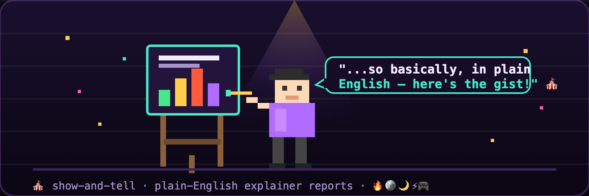
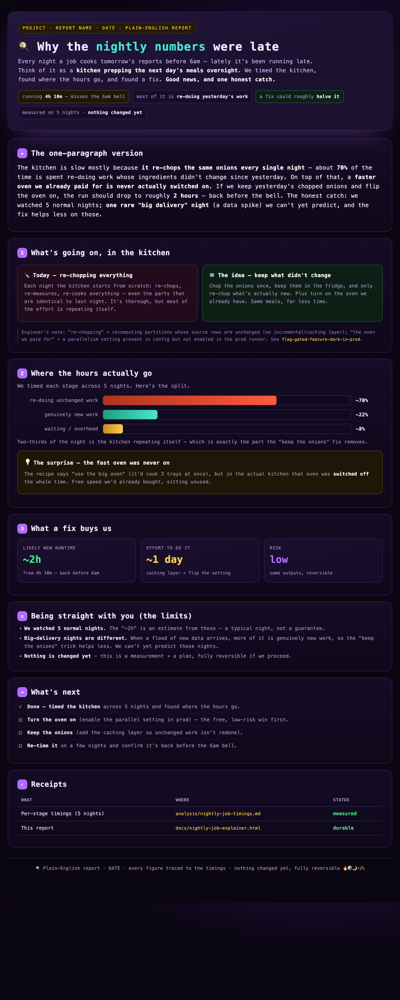

# show-and-tell 🎪

[](LICENSE)
[](https://github.com/wan-huiyan/show-and-tell/commits)
[](https://claude.com/claude-code)
[](#-the-aesthetic-is-the-point)

> **Turn dense technical findings into a beautiful, genuinely plain-English HTML explainer your boss will actually read.** One everyday metaphor, the real numbers shown honestly, engineer's-note asides, a foregrounded honesty box — wrapped in a cute arcade theme that opens straight from `file://`. No build, no server.



```
  ╔══════════════════════════════════════════════════════════════╗
  ║   🎪  S H O W   ·   A N D   ·   T E L L                        ║
  ║                                                                ║
  ║      ▟▙  "...so basically, in plain English,                  ║
  ║     ▗██▖    here's the gist!"  ▕▔▔▔▏ ▕▔▔▔▏ ▕▔▔▔▏              ║
  ║     ▝██▘                       ▕▁▁▁▏ ▕███▏ ▕▁▁▁▏              ║
  ║      ▐▌    🔥 51%  🪙 ~2h  🌙 5 nights  ⚡ honest             ║
  ╚══════════════════════════════════════════════════════════════╝
```

*A Claude Code skill that translates — it doesn't dumb down. The non-expert gets the gist and the honest bottom line; the engineer drops into the asides and finds nothing wrong. 🔥🪙🌙⚡🎮*



<sub>☝️ A real render of the bundled template: *"Why the nightly numbers were late,"* a slow overnight job explained as **a kitchen prepping tomorrow's meals** — every claim paired with a number, the bad news in its own honesty box, engineer's notes inline. Open [`assets/template.html`](assets/template.html) in any browser to see it live.</sub>

---

## ✨ What it does

You just finished something technical — a debugging session, a research result, a measurement, a jargon-heavy analysis doc. Someone busy or non-technical (a boss, a PM, a client) needs to *understand* it. A raw markdown dump won't land. A marketing-y summary they won't trust.

**show-and-tell** produces a single self-contained HTML page that explains the work in plain English, using one everyday metaphor carried all the way through — including the bad news. It's the kind of report someone forwards and the recipient actually reads.

The proven recipe:

| Ingredient | Why it matters |
|---|---|
| 🎯 **One metaphor, held all the way through** | A retrieval system → *a robot librarian who finds the right card.* "Finds it half the time / shouts on every step" → *a librarian who's right half the time but interrupts constantly.* The metaphor is the scaffold the non-expert hangs everything on — so it has to carry the limits too, not just the wins. |
| 🔢 **The real number beside every plain claim** | Not "it works pretty well" — "finds the right answer about **half** the time" *and* the `~51%` bar. Plain words carry the meaning; the number carries the credibility. Honest, not dumbed-down. |
| 🛠️ **"Engineer's note" asides** | A muted layer with the precise mechanism / metric name / exact method. The lay reader's eye skips it; the technical reader drops in. One document, two audiences. |
| ⚖️ **A foregrounded honesty box** | "Here's what we're NOT sure of" gets its own box, not a footnote. Small sample, floor-not-ceiling caveats, the unmeasured bits. This is what separates a translation from a sales pitch. |
| 🕹️ **A cute arcade/pixel aesthetic** | Dark bg, neon bars, fairy-dust palette, animated fills. Opens straight from `file://` — no build step, no server, no dependencies. Just `open` it. |

It ships a **proven HTML template** ([`assets/template.html`](assets/template.html)) you copy and re-bind, plus a **render-safety checker** ([`scripts/check_html.py`](scripts/check_html.py)) that catches the silent "half the page is invisible" CSS-variable bug before anyone opens it.

---

## 🖼️ About the demo (shown above)

The screenshot up top is the bundled template rendered as-is. It's a complete, self-contained worked example — a slow overnight job explained as **a kitchen prepping tomorrow's meals**:

- Every plain claim is paired with its real number (the `~70%` "re-doing yesterday's work" bar).
- The bad news — a rare "big delivery" night the fix helps less on — gets its own honesty box, not a hedge.
- An engineer's note maps the metaphor back to the mechanism: "re-chopping onions" → "recomputing unchanged partitions."

That's the whole recipe on a generic topic, ready for you to swap in yours. Open [`assets/template.html`](assets/template.html) and `python3 scripts/check_html.py assets/template.html` to poke at it.

---

## 🚀 Quick Start

Just describe what you want, in plain words:

> **You:** "Explain these benchmark findings in plain English for my boss — make it pretty and shareable."
>
> **Claude:** *reads your findings → picks one metaphor that carries the whole story (wins AND limits) → copies the template → re-binds each slot with your real numbers → adds engineer's notes → runs the render check → opens the HTML for you.*

It also fires on phrases like *"make this readable,"* *"so my team can understand it,"* *"a one-pager / recap / writeup,"* *"translate these results for a lay audience,"* or *"turn this analysis doc into a friendly explainer"* — even if you never say the word "HTML."

---

## 📦 Installation

**Git clone (always works):**

```bash
git clone https://github.com/wan-huiyan/show-and-tell.git ~/.claude/skills/show-and-tell
```

That's it — Claude Code reads `~/.claude/skills/show-and-tell/SKILL.md` on the next session and the skill is live.

**Plugin install (Claude Code marketplace):**

```bash
/plugin marketplace add wan-huiyan/show-and-tell
/plugin install show-and-tell@wan-huiyan-show-and-tell
```

**Cursor (2.4+):**

```bash
git clone https://github.com/wan-huiyan/show-and-tell.git ~/.cursor/skills/show-and-tell
```

---

## 🆚 Without vs With

| | **Plain markdown dump** | **With show-and-tell** |
|---|---|---|
| What the boss sees | A wall of bullet points, jargon, p-values | One metaphor they already understand, big honest takeaway up top |
| Trust | "Is this spin? Is it real?" | Real number next to every plain claim; limits in their own box |
| The technical reader | Either bored (too simple) or fine (it's their write-up) | Drops into "engineer's note" asides — nothing dumbed-down-to-wrong |
| The bad news | Buried, or quietly omitted | Carried by the same metaphor, called out plainly |
| Shareable? | "Let me clean this up first…" | Forward the `.html` — opens anywhere, no build |
| Pretty? | 😐 | 🎪 arcade theme, animated bars, fairy dust |

The "Without" column isn't a strawman — a markdown summary is a perfectly reasonable default. show-and-tell is for the moment that summary needs to *land* with someone who didn't do the work.

---

## ⚙️ How it works

| Step | What happens |
|---|---|
| 1. **Read the source** | Extract the real numbers, the bottom line, the limits, what was produced. The report is only as honest as your grasp of the facts. |
| 2. **Choose the metaphor** | Everyday and concrete (kitchen, librarian, mail room). Sanity-check it carries the bad news too — if it can only express the wins, it's the wrong metaphor. |
| 3. **Copy the template** | [`assets/template.html`](assets/template.html). Keep the `<style>` block as-is (proven arcade theme); re-bind the content slots. |
| 4. **Write plain** | Short sentences, second person. Name a thing once in metaphor, then reuse it. Jargon → cut it or move it to an engineer's note. |
| 5. **Pair every claim with evidence** | A labelled bar or a stat tile. Never invent a number to fill a tile. |
| 6. **Verify the render** | `python3 scripts/check_html.py your-report.html` — balanced tags + every `var(--x)` defined. Catches the silent invisible-text bug. |
| 7. **Open it** | `open your-report.html` so the user sees it immediately. |

---

## 🕹️ The aesthetic is the point

The warm, playful arcade styling (dark + neon/coin/violet, animated fills, a little fairy dust) isn't decoration for its own sake — it's what makes a person *want* to read a technical report. But the substance stays straight. You're not spinning; you're translating. The fun packaging only works wrapped around genuinely honest content.

---

## 🚧 Limitations

Honesty box for the skill itself (of course it has one):

- **It's for a lay or busy audience — not your rigorous internal write-up.** If you need the full, precise, every-caveat analysis doc, write that instead. This is the *translation*, not the source of truth.
- **It's only as honest as your grasp of the facts.** The skill can't invent rigor you don't have. Garbage understanding in → confidently-wrong explainer out. Read the source material properly first.
- **A forced metaphor can mislead.** If the everyday image only fits the good parts and you stretch it over the bad parts, you'll distort the meaning. The fix is to pick a *different* metaphor, not to abandon the metaphor mid-report. Two candidates in your head; keep the one that carries the whole story.
- **Static HTML, by design.** No live data, no interactivity beyond the CSS bar animation, no dashboard. That's a feature (it opens anywhere from `file://`), but it's not a tool for live monitoring.
- **`check_html.py` is a render-safety net, not a fact-checker.** It catches invisible text and broken tags; it cannot tell you whether your numbers are right or your metaphor is honest. That part's on you.

---

## 🧩 Dependencies

- **Required:** nothing. The output is a single self-contained HTML file (inline CSS, no JS, no external fonts) — it opens in any browser straight from disk.
- **Optional:** `python3` for the render-safety check (`scripts/check_html.py`). Without it you lose the automated invisible-text guard but the skill still works.

---

<details>
<summary>✅ Quality checklist — what a good show-and-tell guarantees</summary>

- One metaphor, named once and reused, that carries the wins **and** the limits.
- Every plain claim paired with its real number (bar or tile) — no number-free spin, no spreadsheet-without-words.
- A one-paragraph honest TL;DR a reader could stop after.
- Limits foregrounded in their own box, not a footnote.
- Engineer's notes where the plain version loses something a technical reader wants.
- If it corrects an earlier claim (even your own), it says so plainly.
- No invented numbers to fill a tile.
- Passes `check_html.py`: balanced tags, every CSS var defined, no leftover `__PLACEHOLDER__`.

</details>

---

## 🔗 Related

- **[publish-skill](https://github.com/wan-huiyan/publish-skill)** — the skill used to package and ship this repo.
- **[pixel-art](https://github.com/wan-huiyan/pixel-art)** — drew the banner mascot above.

---

## 📜 Version History

- **v1.0.0** (2026-06-04) — first public release. Plain-English explainer skill + proven `template.html` (kitchen worked example) + `check_html.py` render-safety checker + pixel banner.

---

## License

MIT — see [LICENSE](LICENSE). Use it, fork it, ship pretty honest reports. 🎪

*Meow meow ~^.^~*
