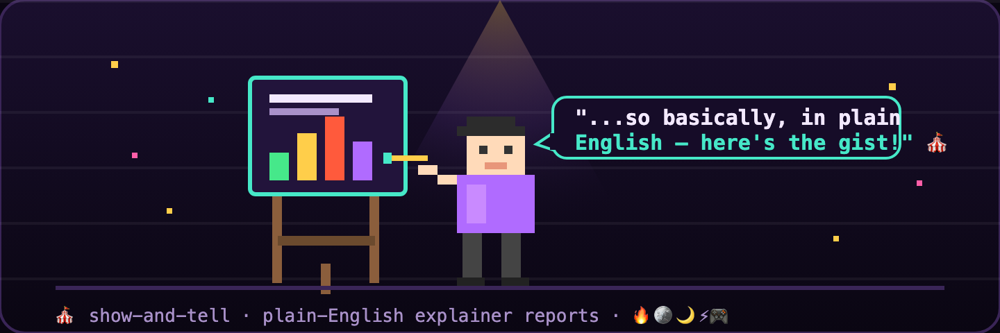
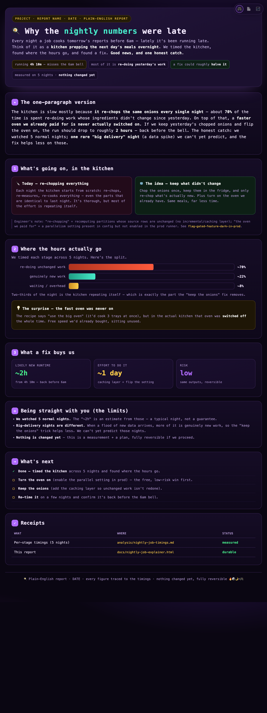

# show-and-tell 🎪

[](LICENSE)
[](https://github.com/wan-huiyan/show-and-tell/commits)
[](https://claude.com/claude-code)
[](#-the-aesthetic-is-the-point)

> **The plain-English HTML explainer that fact-checks its own translation against your source — so what your boss reads is honest, not just pretty.** One everyday metaphor carried the whole way through (the bad news included), the real number beside every plain claim, an engineer's-note layer for the technical reader, and a foregrounded honesty box for what you're *not* sure of. Then a bundled **fact-verifier** checks every claim, number, and metaphor back against the source doc — catching the "could reduce" that quietly became "will halve" before anyone reads it. Self-contained HTML that opens straight from `file://` — no build, no server. *(And yes, it's a cute arcade cabinet.)*



```
╔════════════════════════════════════════════════════════════╗
║                                                            ║
║             S H O W   ·   A N D   ·   T E L L              ║
║                                                            ║
║   "...so basically, in plain English, here's the gist!"    ║
║                                                            ║
║   one metaphor  ·  real numbers  ·  an honest limits box   ║
║                                                            ║
╚════════════════════════════════════════════════════════════╝
```

*A Claude Code skill that translates — it doesn't dumb down. The non-expert gets the gist and the honest bottom line; the engineer drops into the asides and finds nothing wrong. 🔥🪙🌙⚡🎮*



<sub>☝️ A real render of the bundled template: *"Why the nightly numbers were late,"* a slow overnight job explained as **a kitchen prepping tomorrow's meals** — every claim paired with a number, the bad news in its own honesty box, engineer's notes inline. Open [`assets/template.html`](assets/template.html) in any browser to see it live.</sub>

---

## ✨ What it does

You just finished something technical — a debugging session, a research result, a measurement, a jargon-heavy analysis doc. Someone busy or non-technical (a boss, a PM, a client) needs to *understand* it. A raw markdown dump won't land. A marketing-y summary they won't trust.

**show-and-tell** produces a single self-contained HTML page that explains the work in plain English, using one everyday metaphor carried all the way through — including the bad news. It's the kind of report someone forwards and the recipient actually reads.

The proven recipe:

| Ingredient | Why it matters |
|---|---|
| 🎯 **One metaphor, held all the way through** | A retrieval system → *a robot librarian who finds the right card.* "Finds it half the time / shouts on every step" → *a librarian who's right half the time but interrupts constantly.* The metaphor is the scaffold the non-expert hangs everything on — so it has to carry the limits too, not just the wins. |
| 🔢 **The real number beside every plain claim** | Not "it works pretty well" — "finds the right answer about **half** the time" *and* the `~51%` bar. Plain words carry the meaning; the number carries the credibility. Honest, not dumbed-down. |
| 🛠️ **"Engineer's note" asides** | A muted layer with the precise mechanism / metric name / exact method. The lay reader's eye skips it; the technical reader drops in. One document, two audiences. |
| ⚖️ **A foregrounded honesty box** | "Here's what we're NOT sure of" gets its own box, not a footnote. Small sample, floor-not-ceiling caveats, the unmeasured bits. This is what separates a translation from a sales pitch. |
| 🕹️ **A cute arcade/pixel aesthetic** | Dark bg, neon bars, fairy-dust palette, animated fills. Opens straight from `file://` — no build step, no server, no dependencies. Just `open` it. |
| 🎨 **Three reader-switchable themes** | A 🎮/📄/🌌 toggle (top-right; it remembers the choice): **arcade** (default), a print-friendly **paper** light theme, and **midnight**. First visit follows the reader's OS light/dark preference — a light-mode boss lands on paper, not a dark arcade. Print it clean. |
| 🖼️ **A metaphor-illustration slot** | An optional `figure.figure` component: one inline-SVG pixel scene of the metaphor (the chef re-chopping onions *while the oven sits off*). Every fill is a CSS variable so the art recolours itself across all three themes and print. Rule: the picture must carry the bad news too. Pairs perfectly with the [pixel-art](https://github.com/wan-huiyan/pixel-art) skill. |
| 🔎 **A bundled fact-verifier** | Translation drifts. A separate verifier ([`references/fact-verifier.md`](references/fact-verifier.md)) checks every plain claim, number, and the metaphor against the technical source — number-binding, magnitude/causal/metaphor drift, omissions **in both directions** (dropping a reassuring fact leaves the report scarier than its source, and that is drift too), and completion claims against real state rather than prose — and **fails loud** when it can't find the basis. Reduces drift; doesn't replace a human skim. |

It ships a **proven HTML template** ([`assets/template.html`](assets/template.html)) you copy and re-bind, plus a **render-safety checker** ([`scripts/check_html.py`](scripts/check_html.py)) that catches the silent "half the page is invisible" CSS-variable bug — and also verifies theme parity across all three themes, that the page stays truly self-contained (no render-time network fetches), and that every figure has a text alternative and no theme-breaking hardcoded colours — before anyone opens it. It checks the page's **structure**: it does not parse attribute values, execute the page, or lay it out.

---

## 🖼️ About the demo (shown above)

The screenshot up top is the bundled template rendered as-is. It's a complete, self-contained worked example — a slow overnight job explained as **a kitchen prepping tomorrow's meals**:

- Every plain claim is paired with its real number (the `~70%` "re-doing yesterday's work" bar).
- The bad news — a rare "big delivery" night the fix helps less on — gets its own honesty box, not a hedge.
- An engineer's note maps the metaphor back to the mechanism: "re-chopping onions" → "recomputing unchanged partitions."

That's the whole recipe on a generic topic, ready for you to swap in yours. Open [`assets/template.html`](assets/template.html) and `python3 scripts/check_html.py assets/template.html --template` to poke at it (the `--template` flag allows the template's own unfilled `__TITLE__` slot).

---

## 🚀 Quick Start

Just describe what you want, in plain words:

> **You:** "Explain these benchmark findings in plain English for my boss — make it pretty and shareable."
>
> **Claude:** *reads your findings → picks one metaphor that carries the whole story (wins AND limits) → copies the template → re-binds each slot with your real numbers → adds engineer's notes → runs the render check → opens the HTML for you.*

It also fires on phrases like *"make this readable,"* *"so my team can understand it,"* *"a one-pager / recap / writeup,"* *"translate these results for a lay audience,"* or *"turn this analysis doc into a friendly explainer"* — even if you never say the word "HTML."

---

## 📦 Installation

**Git clone (always works):**

```bash
git clone https://github.com/wan-huiyan/show-and-tell.git ~/.claude/skills/show-and-tell
```

That's it — Claude Code reads `~/.claude/skills/show-and-tell/SKILL.md` on the next session and the skill is live.

**Plugin install (Claude Code marketplace):**

```bash
/plugin marketplace add wan-huiyan/show-and-tell
/plugin install show-and-tell@wan-huiyan-show-and-tell
```

**Cursor (2.4+):**

```bash
git clone https://github.com/wan-huiyan/show-and-tell.git ~/.cursor/skills/show-and-tell
```

---

## 🆚 Without vs With

| | **Plain markdown dump** | **With show-and-tell** |
|---|---|---|
| What the boss sees | A wall of bullet points, jargon, p-values | One metaphor they already understand, big honest takeaway up top |
| Trust | "Is this spin? Is it real?" | Real number next to every plain claim; limits in their own box |
| The technical reader | Either bored (too simple) or fine (it's their write-up) | Drops into "engineer's note" asides — nothing dumbed-down-to-wrong |
| The bad news | Buried, or quietly omitted | Carried by the same metaphor, called out plainly |
| Shareable? | "Let me clean this up first…" | Forward the `.html` — opens anywhere, no build |
| Pretty? | 😐 | 🎪 arcade theme, animated bars, fairy dust |

The "Without" column isn't a strawman — a markdown summary is a perfectly reasonable default. show-and-tell is for the moment that summary needs to *land* with someone who didn't do the work.

---

## ⚙️ How it works

| Step | What happens |
|---|---|
| 1. **eli5 framing pass** | A throwaway warm-up in the style of the [eli5](https://github.com/anthropics/claude-plugins-community/tree/main/eli5) skill: explain the topic picture-first, no jargon, to someone who knows nothing. Nothing from this pass ships — it exists to surface the metaphor before the numbers pull the language back toward jargon. |
| 2. **Read the source** | Extract the real numbers, the bottom line, the limits, what was produced. The report is only as honest as your grasp of the facts. |
| 3. **Choose the metaphor** | Start from what the framing pass surfaced; keep it if it survives the real numbers and the bad news. Everyday and concrete (kitchen, librarian, mail room) — if it can only express the wins, it's the wrong metaphor. |
| 4. **Copy the template** | [`assets/template.html`](assets/template.html). Keep the `<style>` block as-is (proven arcade theme); re-bind the content slots. |
| 5. **Write plain** | Short sentences, second person. Name a thing once in metaphor, then reuse it. Jargon → cut it or move it to an engineer's note. |
| 6. **Pair every claim with evidence** | A labelled bar or a stat tile. Never invent a number to fill a tile. |
| 7. **Illustrate the metaphor** *(optional)* | One inline-SVG figure — pixel `<rect>`s on a 7px grid, every fill a `var(--x)`, the bad news drawn in. Skip it freely; text-first. |
| 8. **Verify the render** | `python3 scripts/check_html.py your-report.html` — balanced tags, every `var(--x)` defined, theme parity, self-contained, figures labelled, no hardcoded colours. Catches the silent invisible-text bug. Structure only: for anything interactive, or the page's width on a phone, load it in a browser. |
| 9. **Open it** | `open` (macOS) / `xdg-open` (Linux) / `start` (Windows) `your-report.html` so the user sees it immediately. |

---

## 🕹️ The aesthetic is the point

The warm, playful arcade styling (dark + neon/coin/violet, animated fills, a little fairy dust) isn't decoration for its own sake — it's what makes a person *want* to read a technical report. But the substance stays straight. You're not spinning; you're translating. The fun packaging only works wrapped around genuinely honest content.

---

## 🔬 An honest self-test (n=1)

We ran the skill against its own ethos: one real, number-heavy finding, explained two ways — careful ad-hoc prompting vs. this skill + its fact-verifier — scored blind against the source.

Finding (a pilot, not a proof): careful prompting is already good. The skill's *first draft* shipped two subtle number drifts a plain prompt didn't (a stat bound to the wrong sub-group; an invented "per-session" scope). The bundled fact-verifier caught both — which is the point: writing the metaphor is itself where a number drifts, and the verifier is what catches it. On this input the discipline *matched* careful ad-hoc; the fact-verifier is what earns the skill its keep. Scaling is TODO.

---

## 🚧 Limitations

Honesty box for the skill itself (of course it has one):

- **It's for a lay or busy audience — not your rigorous internal write-up.** If you need the full, precise, every-caveat analysis doc, write that instead. This is the *translation*, not the source of truth.
- **It's only as honest as your grasp of the facts.** The skill can't invent rigor you don't have. Garbage understanding in → confidently-wrong explainer out. Read the source material properly first.
- **A forced metaphor can mislead.** If the everyday image only fits the good parts and you stretch it over the bad parts, you'll distort the meaning. The fix is to pick a *different* metaphor, not to abandon the metaphor mid-report. Two candidates in your head; keep the one that carries the whole story.
- **Static HTML, by design.** No live data, no interactivity beyond the CSS bar animation, no dashboard. That's a feature (it opens anywhere from `file://`), but it's not a tool for live monitoring.
- **`check_html.py` is a render-safety net, not a fact-checker.** It catches invisible text and broken tags; it cannot tell you whether your numbers are right or your metaphor is honest. That part's on you.
- **And it validates the page's structure, not the page working.** It does not parse attribute values and it does not execute the page. Measured: on a page whose one interactive widget was dead because of an unescaped apostrophe inside an attribute, it returned the same CLEAN verdict as on the working page. A pass is "the structure is sound", nothing more — it now says so in its own output.

---

## 🧩 Dependencies

- **Required:** nothing. The output is a single self-contained HTML file (inline CSS, no external fonts, no build, no server — just one tiny inline script for the theme toggle) — it opens in any browser straight from disk.
- **Optional:** `python3` for the render-safety check (`scripts/check_html.py`). Without it you lose the automated invisible-text guard but the skill still works. A browser is optional too, and it is the only thing that can tell you the page runs and fits.

---

<details>
<summary>✅ Quality checklist — what a good show-and-tell guarantees</summary>

- One metaphor, named once and reused, that carries the wins **and** the limits.
- Every plain claim paired with its real number (bar or tile) — no number-free spin, no spreadsheet-without-words.
- A one-paragraph honest TL;DR a reader could stop after.
- Limits foregrounded in their own box, not a footnote.
- Engineer's notes where the plain version loses something a technical reader wants.
- If it corrects an earlier claim (even your own), it says so plainly.
- No invented numbers to fill a tile.
- If there's an illustration: inline SVG only, theme-var colours, the bad news drawn in, and an `aria-label` so it's not invisible to screen readers.
- Passes `check_html.py`: balanced tags, every CSS var defined, theme parity across 🎮/📄/🌌, self-contained (no render-time network), figures labelled, no hardcoded colours, no leftover `__PLACEHOLDER__`. (Structure only — it does not parse attribute values or run the page.)
- The fact-verifier ran and its **omission list has entries pointing both ways**, or you know why it doesn't; every "done"/"merged"/"cleared out" was checked against real state, not against a document describing the work.

</details>

---

## 🔗 Related

- **[publish-skill](https://github.com/wan-huiyan/publish-skill)** — the skill used to package and ship this repo.
- **[pixel-art](https://github.com/wan-huiyan/pixel-art)** — drew the banner mascot above, and the recommended companion for the metaphor-illustration slot: its `<rect>`-on-a-7px-grid SVG characters drop straight into `figure.figure` (swap literal colours for theme vars).
- **[eli5](https://github.com/anthropics/claude-plugins-community/tree/main/eli5)** — the warm-up. Step 1 of the build is an eli5-style picture-first pass, done to find the metaphor before the report is written. eli5 on its own is also the right tool when there is no source document to be faithful to and you just want a topic explained simply.

---

## 📜 Version History

- **v2.4.0** (2026-09-09) — **an eli5 framing pass is now step 1 of the build.** Before reading the source, do a throwaway picture-first explanation in the style of the [eli5](https://github.com/anthropics/claude-plugins-community/tree/main/eli5) skill: no jargon, aimed at someone who knows nothing. Nothing from it ships. Its job is to surface the load-bearing metaphor and the one sentence an outsider needs *before* the real numbers and caveats pull the language back toward jargon — and to reveal early when a topic has no single clean picture, which means it wants splitting into more than one report or figure. Step 2 (choose the metaphor) now starts from what the pass surfaced rather than from a blank page. The build list and the README's "How it works" table are renumbered accordingly; no behaviour changed in the template, the fact-verifier, or `check_html.py`.

- **v2.3.0** (2026-08-07) — **the fact-verifier was blind to what a report leaves out.** Six changes:
  - **Omissions count in both directions** (check 5). Dropping a caveat was the only kind it named. Dropping a *reassuring* fact leaves the report scarier than its own source, and two passes over one real report missed the same two instances.
  - **Omissions get their own output rows, with a verdict.** An omission has no claim to quote, so it fell straight through a table of quoted claims.
  - **New check 9 — "done" is checked against real state, never prose.** A source describing a clean-up reads as support for "was cleared out" while the pull request doing it is still open. The dispatch prompt gained a third input saying where that state is.
  - **`check_html.py` states its limits in its own pass line.** It checks structure, so it cannot see a broken attribute value, a page that fails to run, or one that runs off the side of a phone.
  - **Template layout fix** for the last of those: a long file path in a receipts cell had nowhere to break, and two real reports came out **527px and 691px wide inside a 390px viewport**.
  - **New `tests/check_versions.py` in CI** — the four version fields must agree, and against a base ref, shipped content must actually have been bumped.

  **It also restores 40 lines that were never published.** A local plugin cache labelled 2.2.0 held the whole *"if the report asks the reader anything, make it tickable"* preference — a 31-line section plus a pointer to it and a seven-line edit to step 8. No branch or release in this repository carried any of it, so the next plugin update would have replaced that folder. The 31-line section is restored byte for byte; the step-8 edit was rewritten to drop a path into a private repository, which a public skill cannot usefully point at. *(This entry, the v2.3.0 release notes and the merge commit first said **41** lines. That was `grep -c '^+'` over a unified diff, which counts the `+++` header line as an addition. Measured: 40 added, 2 removed, 208 → 246 lines.)*

- **v2.2.0** (2026-07-08) — the fact-verifier now names two drift modes it was missing: **sub-group / category mis-binding** (a real number bound to the wrong subset) and **invented scope qualifiers** (a `per-session` / `per-run` / "every" the source never stated); its framing is sharpened to *fidelity-to-your-source* (not world-truth); SKILL.md now flags that **the metaphor/prose layer is itself a drift surface** (keep the metaphor light on number-dense findings; let engineer's-notes carry sub-group boundaries); README lede repositioned to lead with the honesty/anti-drift discipline; added an **honest self-test** section. All grounded in an n=1 A/B pilot.
- **v2.1.0** (2026-07-03) — a **metaphor-illustration slot** (`figure.figure`: inline-SVG pixel scenes, theme-var colours, "the picture carries the bad news too" — with a [pixel-art](https://github.com/wan-huiyan/pixel-art) integration path); themes now **auto-detect the reader's OS light/dark preference** on first visit; `check_html.py` grew four checks (theme parity, self-contained guard, figure text-alternatives, hardcoded-colour detection); the fact-verifier now checks **figure captions** for drift; accessible bar charts (`aria-label`s); cross-platform open instructions; a `sync-plugin.sh` + CI guard so the plugin copy can't drift from the root skill.
- **v2.0.0** (2026-06-04) — a **theme switcher** (🎮 arcade / 📄 paper-light / 🌌 midnight, print-friendly) baked into every report; a bundled **fact-verifier** (`references/fact-verifier.md`) that checks the plain-English claims against the technical source for *drift* before you ship; banner + README polish.
- **v1.0.0** (2026-06-04) — first public release. Plain-English explainer skill + proven `template.html` (kitchen worked example) + `check_html.py` render-safety checker + pixel banner.

---

## License

MIT — see [LICENSE](LICENSE). Use it, fork it, ship pretty honest reports. 🎪

*Meow meow ~^.^~*
